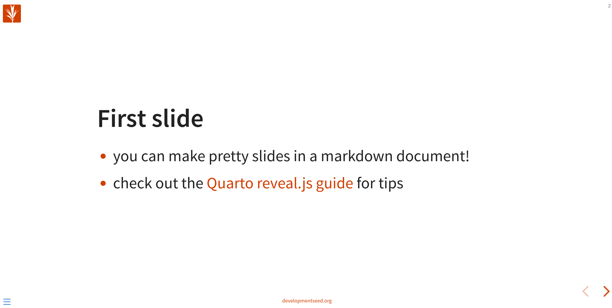

# quarto-reveal.js-presentation-template
A template for creating a presentation with Quarto and reveal.js

## How to use this template

1. Create a new repository from this template and clone it to your local environment

2. Install quarto

3. Run `quarto publish gh-pages` to set up a `gh-pages` branch and configure the github pages deployment.

4. Uncomment the `publish` step in [.github/workflows/quarto-publish.yml] and push to the remote repository

  - This should trigger a build on the `gh-pages` branch which should be published to https://developmentseed.github.io/{repo_name}

## Custom theme
- By default the theme is set to reveal.js `white` theme. For a dark theme try `black` in the yaml header of `index.md`.
- [styles.css](./styles.css) has css rules for some of the style elements which allows us to orange things up a bit.

## Local development
You can run a local preview of the presentation with `quarto preview`. This will load a live preview of the presentation as you work on it.
